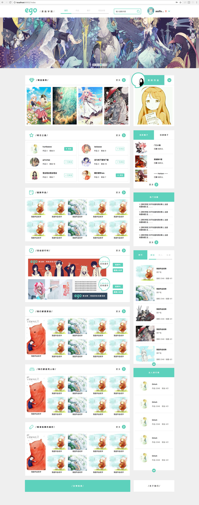
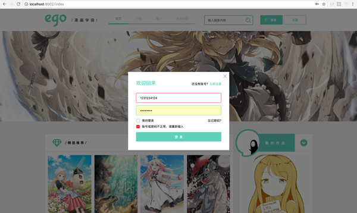
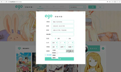
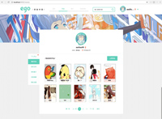
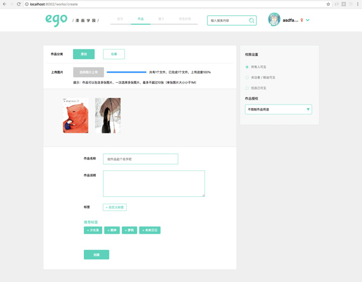

<h1>网易-Mini项目实战：Ego社区</h1>
<h3>项目介绍</h3>

网站类型：二次元社区

<ul>
	<li>项目首页：轮播图展示作品、明日之星关注、用户注册、用户登录</li>
	<li>作品列表页：分页器展示 登录用户个人的作品列表、可坐编辑、删除操作、根据生日计算用户星座并显示。</li>
	<li>作品创建页：设置作品名称、标签、分类、权限、上传作品图片（支持批量上传、拖拽上传，限制单次上传图片的数量和大小）</li>
</ul>
<h3>终端命令</h3>
<ul>
	<li><code>npm install nei -g</code> 若未安装nei脚手架，先全局安装nei</li>
	<li><code>nei server</code> 在项目根目录下，启动 本地项目服务器</li>
</ul>
<h3>页面地址</h3>
<ul>
	<li>项目首页：<a href="http://localhost:8002/index" target="_blank">http://localhost:8002/index</a></li>
	<li>作品列表页：<a href="http://localhost:8002/works" target="_blank">http://localhost:8002/works</a></li>
	<li>作品创建页：<a href="http://localhost:8002/works/create" target="_blank">http://localhost:8002/works/create</a></li>
</ul>
<h3>项目展示</h3>
<table>
	<tr style="text-align:center;">
		<th>首页</th>
		<th>登录框</th>
		<th>注册框</th>
		<th>作品页</th>
		<th>编辑页</th>
	</tr>
	<tr>
		<td></td>
		<td></td>
		<td></td>
		<td></td>
		<td></td>
	</tr>
</table>